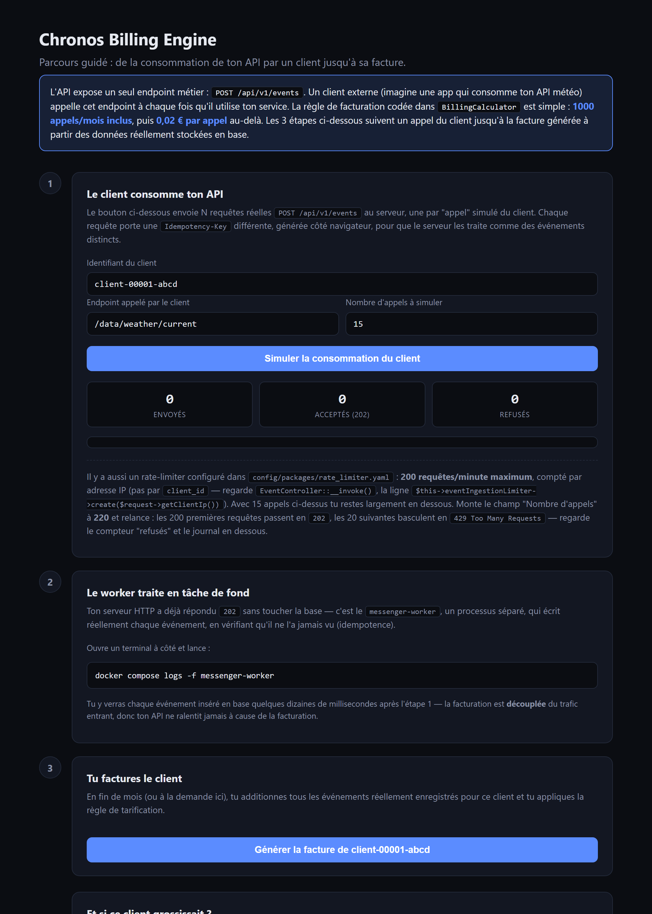

# Chronos Billing Engine

API REST d'ingestion d'événements à fort trafic et de facturation, construite comme un **laboratoire R&D** démontrant une maîtrise de l'Architecture Hexagonale, du DDD, du TDD et de la sécurité applicative en PHP 8.4 / Symfony 8.

> Projet portfolio — voir [`ARCHITECTURE.md`](./ARCHITECTURE.md) pour une lecture orientée décision technique/RH, et [`SECURITY.md`](./SECURITY.md) pour la couverture OWASP.

## Aperçu

C'est une API pure (pas d'interface graphique en production) : un seul endpoint métier, `POST /api/v1/events`. Pour explorer le flux sans taper de `curl`, le projet inclut une page de démo (`public/demo.html`, servie par le projet lui-même une fois la stack lancée) qui fait tourner le cycle complet — un client simule des appels, le worker les traite en tâche de fond, puis la facture est générée à partir des données réellement stockées en base.



## Stack technique

| Composant | Choix | Rôle |
|---|---|---|
| Langage | PHP 8.4 (`strict_types`, readonly, enums) | Cœur applicatif |
| Framework | Symfony 8 | HTTP, DI, Messenger, Sécurité |
| Persistance | PostgreSQL 16 via Doctrine ORM 3 | Adaptateur de sortie |
| Asynchrone | Symfony Messenger (transport Doctrine) | Découplage ingestion / traitement |
| Logs | Monolog (JSON structuré) | Observabilité |
| Tests | PHPUnit 11 | TDD sur le Domaine et l'Application |
| Qualité | PHPStan niveau 8 | Analyse statique stricte |

## Démarrage en local (Docker)

### Prérequis
- Docker & Docker Compose v2
- (optionnel) `curl` ou Postman pour tester l'API

### 1. Cloner et configurer

```bash
git clone https://github.com/<votre-user>/chronos-billing-engine.git
cd chronos-billing-engine
cp .env.example .env.local   # ajustez les secrets si besoin, .env fournit déjà des valeurs de dev
```

Le fichier `.env` fourni contient déjà des valeurs de développement fonctionnelles (base Postgres locale, clé API de test). **Ne jamais réutiliser ces valeurs en production.**

### 2. Lancer la stack

```bash
docker compose up --build
```

Cela démarre 4 services :

| Service | Rôle | Port |
|---|---|---|
| `postgres` | Base de données PostgreSQL 16 (Alpine) | 5432 |
| `app` | PHP-FPM 8.4 (l'application Symfony) | interne (9000) |
| `nginx` | Reverse proxy HTTP | **8000** (exposé) |
| `messenger-worker` | Worker consommant la queue asynchrone | interne |

### 3. Installer les dépendances et migrer la base (première exécution)

```bash
docker compose exec app composer install
docker compose exec app php bin/console doctrine:migrations:migrate --no-interaction
```

### 4. Tester l'ingestion d'un événement

```bash
curl -i -X POST http://localhost:8000/api/v1/events \
  -H "Content-Type: application/json" \
  -H "X-Api-Key: local-dev-api-key" \
  -H "Idempotency-Key: test-key-001" \
  -d '{"client_id": "client-00001-abcd", "endpoint": "/api/v1/orders"}'
```

Réponse attendue : `202 Accepted` (l'événement est déposé sur la queue Messenger, puis traité de manière asynchrone par `messenger-worker` — vérifiable dans ses logs : `docker compose logs -f messenger-worker`).

Renvoyer exactement la même requête avec la même `Idempotency-Key` ne crée **pas** de second enregistrement (voir la section Idempotence de `ARCHITECTURE.md`).

Pour consulter la facture calculée à partir des événements enregistrés (1000 appels/mois inclus, puis 0,02 €/appel — voir `BillingCalculator`) :

```bash
curl -s "http://localhost:8000/api/v1/clients/client-00001-abcd/invoice" -H "X-Api-Key: local-dev-api-key"
```

Ou directement via la page de démo interactive : **http://localhost:8000/demo.html**

### 5. Lancer les tests et l'analyse statique

```bash
docker compose exec app composer test   # PHPUnit
docker compose exec app composer stan   # PHPStan niveau 8
```

### 6. Scaler les workers (démonstration du découplage async)

```bash
docker compose up --scale messenger-worker=3 -d
```

## Structure du projet

```
src/
├── Domain/         # Cœur métier pur PHP — zéro dépendance framework
├── Application/     # Cas d'usage, orchestration, messages Messenger
└── Infrastructure/  # Contrôleurs, Doctrine, sécurité, config technique
tests/Unit/          # Tests TDD (Domain + Application, mockés)
migrations/          # Schéma PostgreSQL versionné
config/              # Configuration Symfony (Messenger, Monolog, sécurité...)
```

Voir [`ARCHITECTURE.md`](./ARCHITECTURE.md) pour le détail des choix de conception.

## Documentation associée

- [`ARCHITECTURE.md`](./ARCHITECTURE.md) — explications architecturales, y compris pour un public non-développeur (RH / Tech Lead)
- [`SECURITY.md`](./SECURITY.md) — couverture OWASP Top 10 / API Security Top 10
- [`DEPLOYMENT_GCP.md`](./DEPLOYMENT_GCP.md) — déploiement production sur Google Cloud (Cloud Run + Cloud SQL + Pub/Sub)

## Licence

MIT — projet de démonstration technique.
